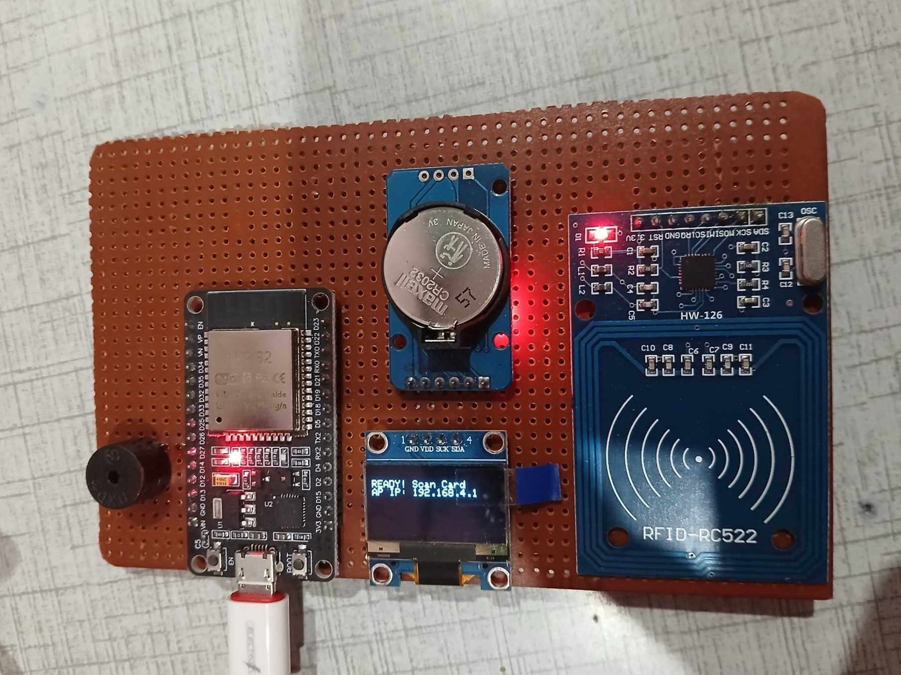
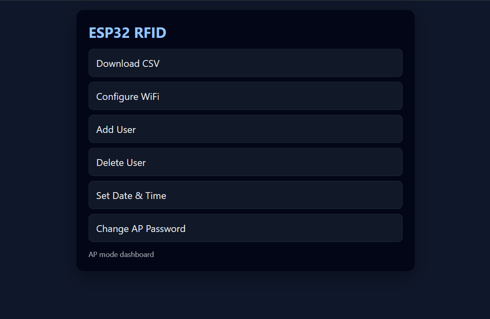
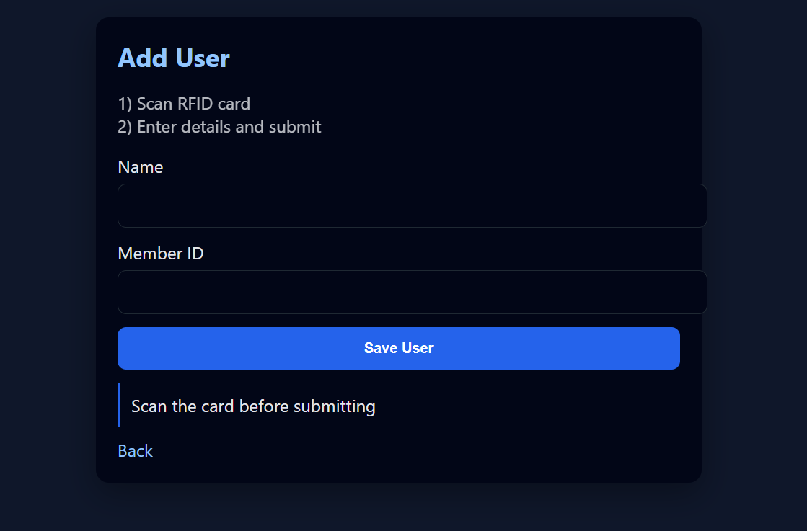
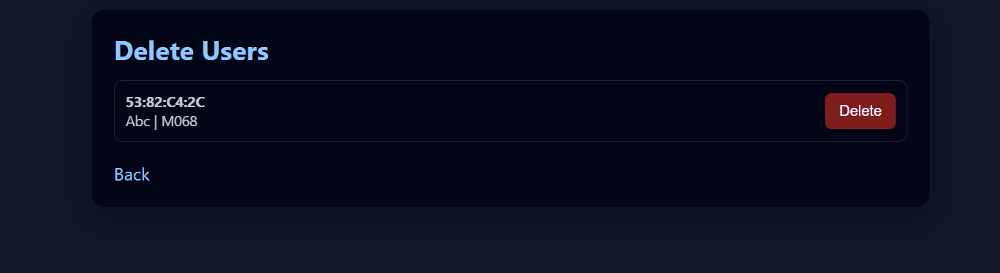
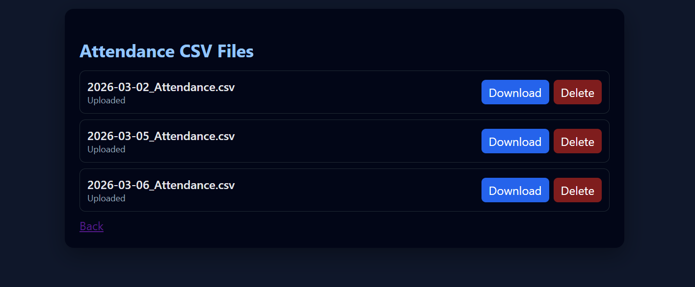
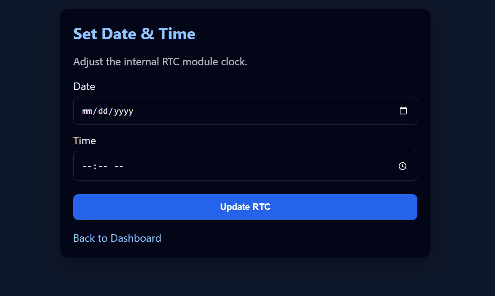
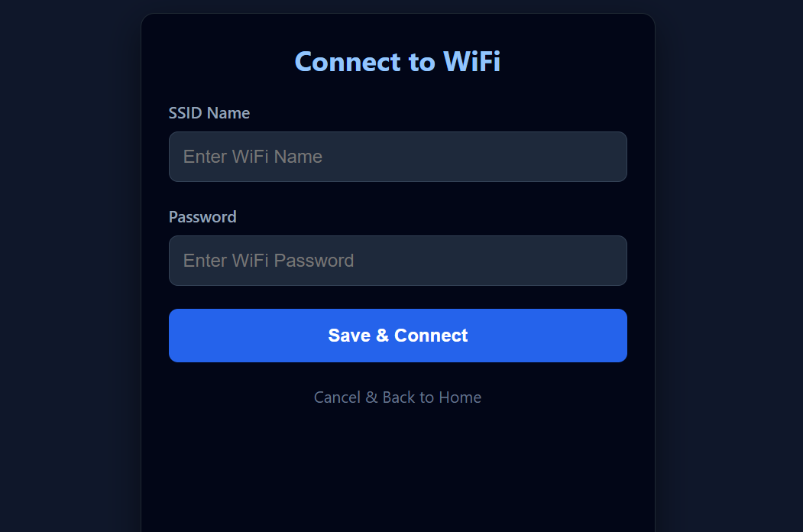
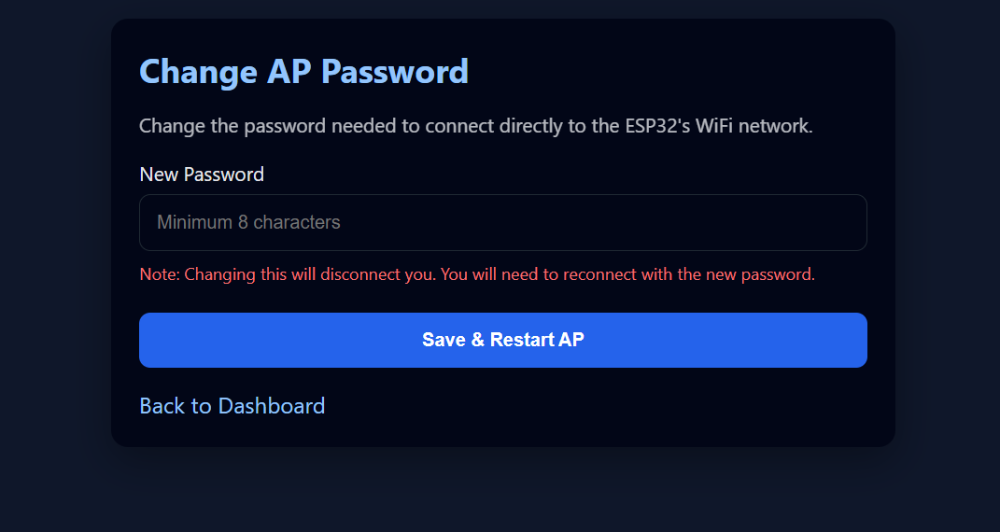

# 📟 ESP32 Offline-First RFID Attendance System

An enterprise-grade, highly optimized RFID attendance system built on the ESP32 microcontroller. Designed for environments with unstable or non-existent internet connections, this system operates completely offline, logging attendance data to local flash memory, and features an auto-sync engine that securely pushes data to a remote Python backend when a known network becomes available.

Unlike standard ESP32 web-server projects that are prone to heap fragmentation and stack overflows when handling large JSON payloads, this system implements a custom **O(1) memory-footprint architecture**. By utilizing line-by-line CSV streaming and HTTP Chunked Transfer Encoding directly from LittleFS, the system scales to support **thousands of registered users** and **tens of thousands of attendance logs** without hardware failure.

## 🎥 Project Demonstration

Watch the system in action, demonstrating the rapid RFID scanning, local OLED feedback, and standalone operation:

  
*(Click the image to watch the demonstration on YouTube)*

---

## ✨ System Architecture & Key Features

* **Resilient Offline-First Logging:** Utilizes a DS3231 Hardware RTC to timestamp attendance records precisely, completely independent of NTP servers.
* **Low-RAM Streaming Architecture:** Bypasses microcontroller RAM limitations by streaming raw CSV data directly from `LittleFS` to the web client and remote backend.
* **AP Mode Administrative Dashboard:** Hosts an embedded web server (Access Point) providing a responsive UI for local device management, requiring zero external dependencies.
* **Automated Cloud Synchronization:** Periodically scans for configured Station (STA) WiFi networks. Upon connection, it securely `POST`s pending CSV logs to a designated endpoint, verifies the upload, and wipes local WiFi credentials to return to a secure AP state.
* **Complete CRUD Interface:** Administrators can dynamically add users via RFID scanning, delete users, configure AP security passwords, and download raw CSV files directly from the ESP32 dashboard.
* **Instant Audio-Visual Feedback:** Integrates an SSD1306 OLED display, dual status LEDs, and an active buzzer to provide sub-second physical feedback during authentication.

---

## 📱 Web Dashboard Interface

The administrative panel is hosted natively on the ESP32. Connect to the device's secure Access Point to manage the database and configure synchronization settings.

  

### User Database Management
Register new cards with mapped employee/student IDs, or remove deprecated credentials seamlessly without rewriting the entire database.

  
  &nbsp; &nbsp;
  

### Data Extraction & Configuration
Download daily attendance logs, sync the hardware RTC clock, input target backend WiFi networks, or update the device's AP security protocols.

  
  &nbsp; &nbsp;
  

  
  &nbsp; &nbsp;
  

---

## 🛠️ Hardware Specifications

* **Core Unit:** ESP32 Development Board (e.g., NodeMCU-32S)
* **Authentication:** MFRC522 13.56MHz RFID Reader (SPI Interface)
* **Timekeeping:** DS3231 Precision RTC Module (I2C Interface)
* **Display Output:** 0.96" SSD1306 OLED Screen (I2C Interface)
* **Status Indicators:** 1x Green LED (Success), 1x Red LED (Denial), 1x Active Buzzer

### 🔌 Detailed Pin Mapping
| Hardware Component | ESP32 GPIO | Interface Protocol |
| :--- | :--- | :--- |
| **MFRC522 (RST)** | GPIO 4 | System Reset |
| **MFRC522 (SDA/SS)**| GPIO 5 | SPI Chip Select |
| **MFRC522 (SCK)** | GPIO 18 | SPI Clock |
| **MFRC522 (MISO)** | GPIO 19 | SPI Master In Slave Out |
| **MFRC522 (MOSI)** | GPIO 23 | SPI Master Out Slave In |
| **OLED & RTC (SDA)**| GPIO 21 | I2C Data Line |
| **OLED & RTC (SCL)**| GPIO 22 | I2C Clock Line |
| **Green LED** | GPIO 15 | Digital Out (Success State) |
| **Red LED** | GPIO 2 | Digital Out (Error State) |
| **Buzzer** | GPIO 27 | Digital Out (Audio Feedback)|

> **Note:** Ensure 330Ω current-limiting resistors are placed in series with the LEDs to prevent GPIO damage.

---

## 💻 Software Stack & Dependencies

### Firmware (C++)
* `MFRC522` (GithubCommunity) - RFID communication.
* `Adafruit SSD1306` & `Adafruit GFX Library` - Display rendering.
* `RTClib` (Adafruit) - I2C clock synchronization.
* `ArduinoJson` (Benoit Blanchon) - Strict usage for lightweight config parsing.
* Built-in ESP32 Cores: `WiFi`, `WebServer`, `SPI`, `Wire`, `LittleFS`, `HTTPClient`.

### Remote Backend
* A dedicated Python Flask application integrated with SQLite handles the ingestion of `POST` requests containing the CSV payloads from the ESP32.

---

## 🚀 Deployment Guide

### 1. Flash the Firmware
1. Configure your Arduino IDE with the **ESP32 Board Package**.
2. Install all required dependencies via the Library Manager.
3. Set your partition scheme to allow file storage (e.g., `Default 4MB with spiffs/LittleFS`).
4. Compile and flash the `.ino` firmware to the board.

### 2. Standalone Initialization (AP Mode)
1. Power the ESP32. It will broadcast an SSID: `ESP32-RFID` (Default Pass: `12345678`).
2. Connect a client device and navigate to the local IP (displayed on the OLED, typically `192.168.4.1`).
3. **Calibrate System Time:** Go to **Set Date & Time** to align the hardware RTC.
4. **Populate Database:** Navigate to **Add User**, present an RFID tag, and input the associative member data.

### 3. Backend Synchronization
1. On the local dashboard, select **Configure WiFi**.
2. Input the credentials of a network with internet access.
3. The system will safely terminate the AP, connect to the target network, push all localized CSV files to `/upload`, verify the transaction, wipe the network credentials from memory, and restore the secure AP state.

---

## 📂 Flash Memory Architecture (LittleFS)

To strictly enforce memory efficiency, operational variables are dynamically read from the file system rather than stored in the heap:
* `/users.csv` - Master relational database for registered UIDs. Read sequentially during authentication.
* `/YYYY-MM-DD_Attendance.csv` - Dynamically generated daily transaction logs.
* `/wifi.json` - Volatile storage for target synchronization networks.
* `/ap_config.json` - Persistent storage for administrator dashboard credentials.
* `/sync.json` - State-tracker verifying which daily logs have achieved absolute sync with the remote server.

---

## 🔮 Roadmap & Future Optimizations
- [ ] **Display Power Management:** Implement an interrupt-driven sleep mode for the OLED to prevent pixel burn-in during idle states.
- [ ] **Hardware Watchdog (WDT):** Enable automated system recovery to handle isolated I2C/SPI bus hangs.
- [ ] **OTA Updates:** Support Over-The-Air firmware updates directly through the administrative dashboard.